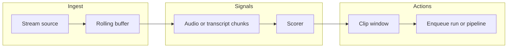

# YouTube Live

Clip Engine can **record an ongoing (or scheduled) live broadcast** into a run workspace with **yt-dlp**, then run the normal **ingest → plan → render** pipeline on the saved file. This is **manual** capture: you start recording from **Import → YouTube Live**, stop from the run page (or wait for the stream to end / max duration), then **Start pipeline**.

**Automatic “autoclip”** while a stream is running (rolling buffer + scoring + enqueue) is **not** implemented; see [Phase 3 — Autoclip](#phase-3--autoclip-future) and `clipengine_api.services.live_autoclip`.

## Phase 1 — Spike conclusions (ingest path)

| Approach | Notes |
|----------|--------|
| **yt-dlp (chosen for MVP)** | Same binary as VOD import; writes `source.%(ext)s` under the run folder. Handles many sites YouTube exposes; flags are tunable via env. Stopping sends **SIGTERM** so partial files can still be validated. |
| **FFmpeg on a direct stream URL** | Possible alternative: resolve a URL with `yt-dlp -g` and pass to `ffmpeg`. Not required for the first ship; adds another failure surface (formats, reconnect). |

**Failure modes:** DRM, geo-blocks, age-gated or members-only streams, dropped network, or stream end before minimum file size. Logs are written to **`yt-dlp.log`** in the run directory.

**Segmented vs single file:** MVP uses a **single growing file** until stop or stream end. **Chunked / rolling buffer** is reserved for Phase 3.

## Phase 2 — MVP (implemented)

- **API:** `POST /api/runs` with `source_type: "youtube_live"` and `youtube_url` — run status **`recording`** until capture finishes, then **`ready`** (or **`failed`**).
- **Stop:** `POST /api/runs/{id}/live/stop` — SIGTERM yt-dlp; the run moves to **`ready`** when the output file passes size checks.
- **Cancel:** `POST /api/runs/{id}/cancel` — same as other jobs; also terminates yt-dlp (VOD fetch uses the same tracked subprocess registry).
- **Pipeline:** Unchanged — once **`ready`**, choose output destination and start the pipeline as for any other source.

Environment variables: **[configuration.md — YouTube Live capture](configuration.md#youtube-live-capture)**.

Docker: capture runs **inside the `api` process** (same as VOD `yt-dlp`). Ephemeral **worker** containers are only used for **`execute_pipeline_run`** after the run is **`ready`** — see **[docker.md — YouTube Live](docker.md#youtube-live-capture)**.

## Phase 3 — Autoclip (future)

Planned pieces (see also `clipengine_api/services/live_autoclip.py`):

- Rolling buffer and candidate detection (VAD / heuristics / chunked LLM on transcript text).
- Policy: max clips per hour, minimum gap, cooldown.
- Enqueue clip jobs (new runs or internal segments) and optional catalog/automation integration.

## Architecture (high level)

## Related docs

- **[pipeline.md](pipeline.md)** — VOD ingest → plan → render chain.
- **[configuration.md](configuration.md)** — environment variables.
- **[docker.md](docker.md)** — where capture and workers run.
