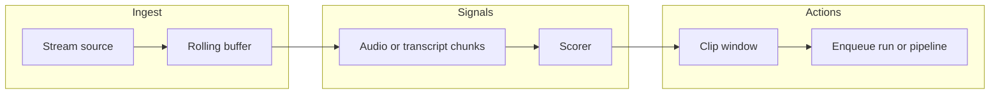

# YouTube Live (roadmap)

Automatic clipping from a **live** YouTube stream is **not** implemented in the current release. This document records a phased approach so product and engineering stay aligned.

## Goals

- Ingest a live stream (or DVR-style window) into a rolling buffer.
- Detect candidate moments (heuristics, optional LLM on transcript chunks, cooldowns).
- Enqueue Clip Engine runs or clip segments without manual VOD import.

## Constraints

- **Legal / ToS:** Live capture must comply with YouTube and your deployment’s terms; many streams prohibit redistribution.
- **Resources:** Long-running buffers need CPU/GPU/RAM and disk budgets; concurrent live jobs multiply cost.
- **Latency:** “Clip when something good happens” implies either near–real-time scoring or acceptable delay between event and clip.

## Phased design

### Phase 1 — Design and spike

- Choose ingest path: **`yt-dlp`** live mode vs **FFmpeg** directly from a stream URL.
- Define failure modes (dropped stream, DRM, geo) and operator UX (start/stop, logs).
- Document env flags and quotas (see **[configuration.md](configuration.md)** when implemented).

### Phase 2 — MVP (manual control)

- Start/stop monitoring; fixed rolling buffer (e.g. N minutes on disk).
- Heuristic candidates: silence/VAD/energy or fixed time windows.
- Optional LLM on **chunked** transcript text (cost/latency tradeoff).

### Phase 3 — Full auto-clip

- Scoring policy: LLM + rules (max clips per hour, minimum gap, transcript alignment).
- Integration with the **media catalog** and **Automation** dashboard.
- Optional webhook or notification when a clip is ready.

## Architecture (high level)

## Related docs

- **[pipeline.md](pipeline.md)** — current VOD ingest → plan → render chain.
- **[docker.md](docker.md)** — where long-running processes might run (future).

When an implementation lands, update **[configuration.md](configuration.md)** with new environment variables and **[architecture.md](architecture.md)** with API routes.
